# Welcome to Wifind

Welcome to Wifind, your ultimate companion for finding and sharing free Wi-Fi hotspots! Whether you're a traveler, student, or just someone on the go, Wifind makes it easy to discover free Wi-Fi spots near you. 

## About Wifind

Have you ever found yourself in need of a free Wi-Fi connection, desperately searching for a signal? Look no further - Wifind is here to help. With our app, you can:

- **Find Free Wi-Fi Spots**: Use the interactive map to locate all the free Wi-Fi hotspots in your vicinity. Never be without a connection again!

- **Add New Wi-Fi Spots**: If you discover a new free Wi-Fi hotspot that's not on our map, you can easily contribute by adding it to our database. Help your fellow users stay connected!

- **Receive Notifications**: Wifind keeps you in the loop by sending you notifications when you're within 50 meters of a free Wi-Fi hotspot. No more missed opportunities to connect!

Wifind is designed to make your life easier, whether you're a digital nomad, a student studying at a cafe, or simply someone who values staying connected on the go.

## Screenshots

### White Mode

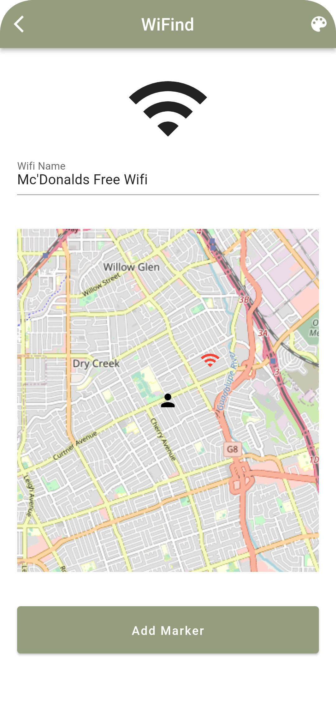
*Search for free Wi-Fi hotspots in white mode.*

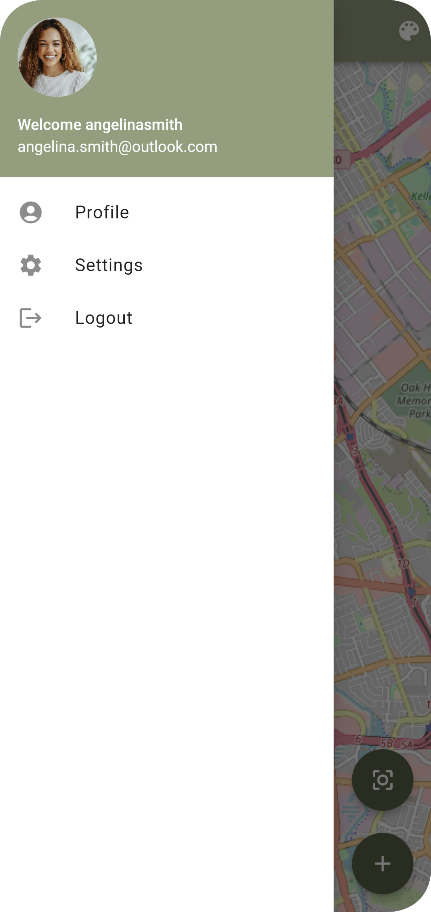
*Add new Wi-Fi spots to help the community in white mode.*

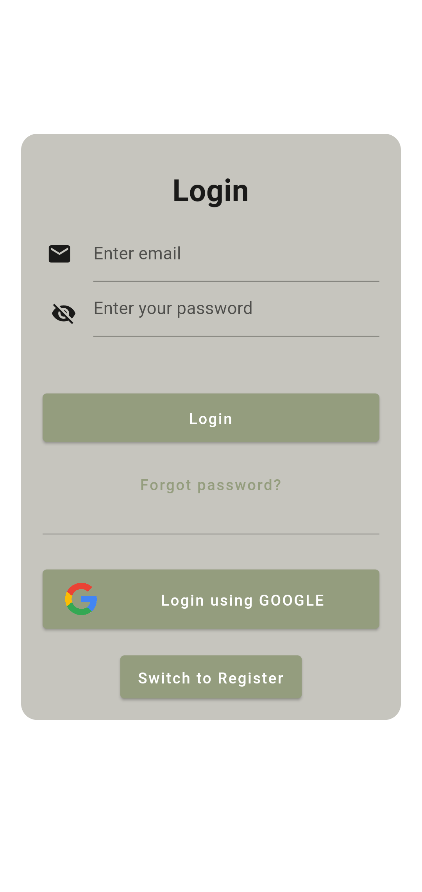
*The login screen in white mode.*

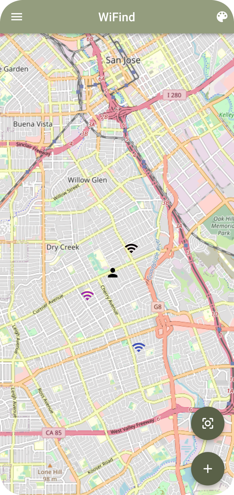
*The main screen in white mode.*

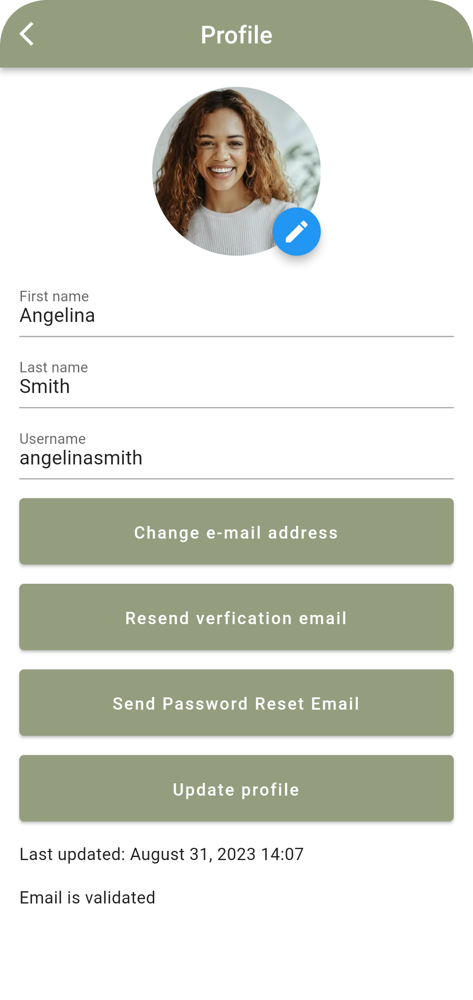
*Your user profile in white mode.*

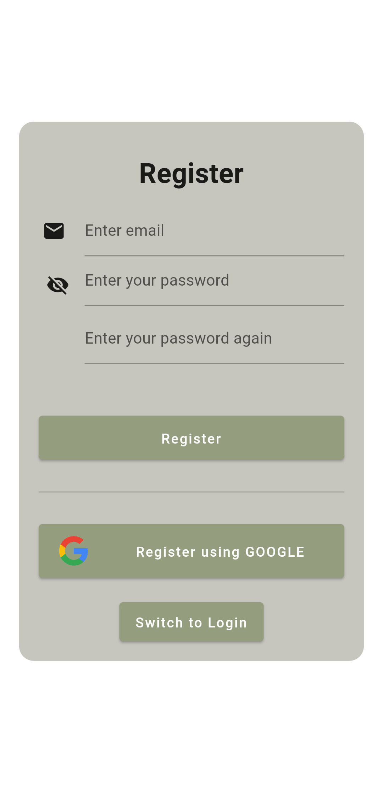
*Register for an account in white mode.*

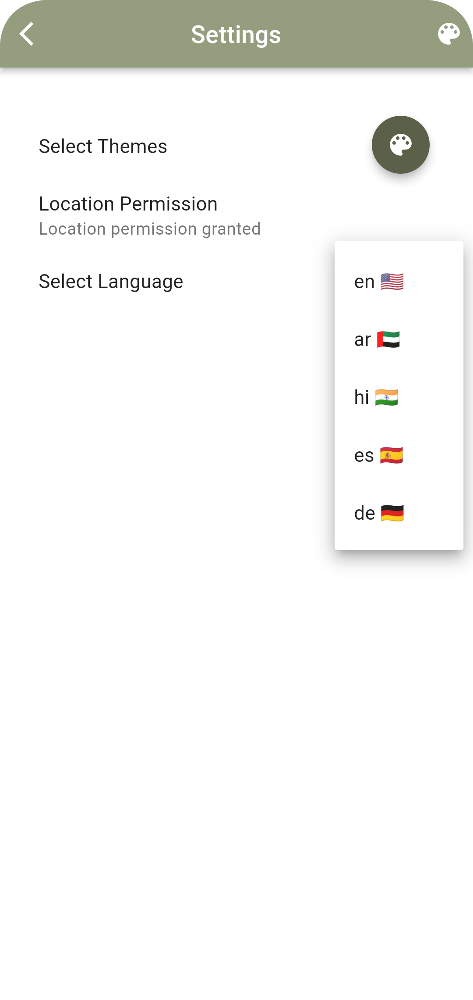
*Access app settings in white mode.*

### Dark Mode

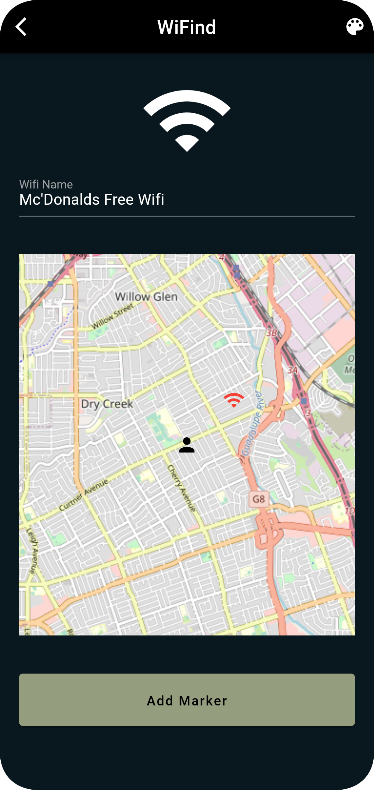
*Search for free Wi-Fi hotspots in dark mode.*

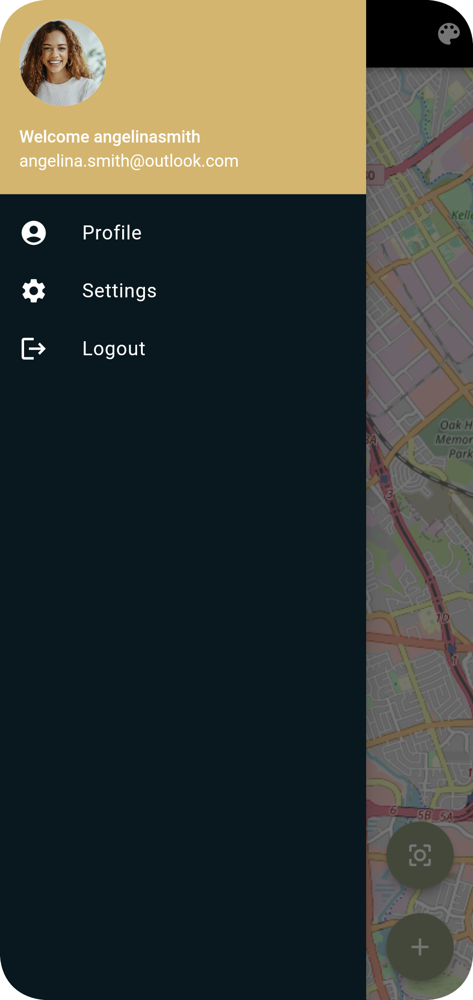
*Add new Wi-Fi spots to help the community in dark mode.*

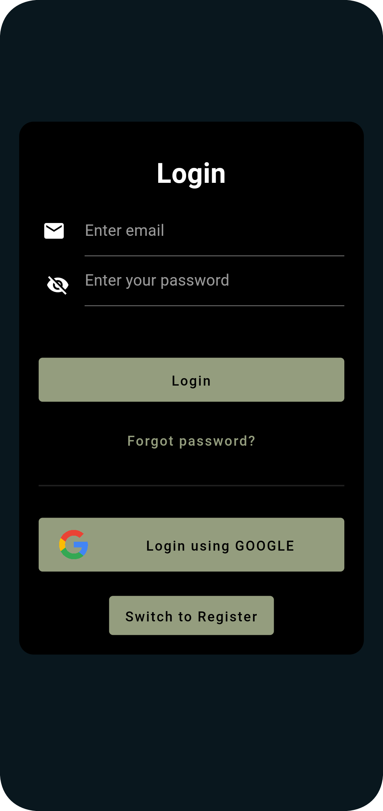
*The login screen in dark mode.*

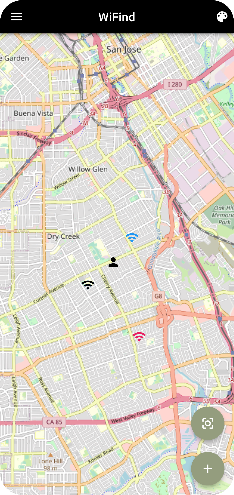
*The main screen in dark mode.*

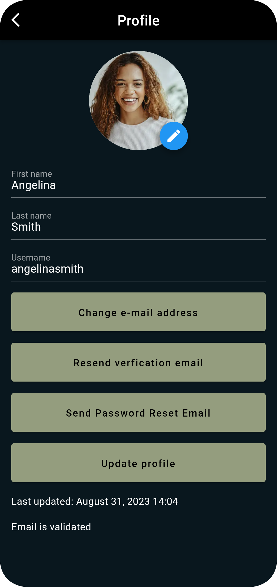
*Your user profile in dark mode.*

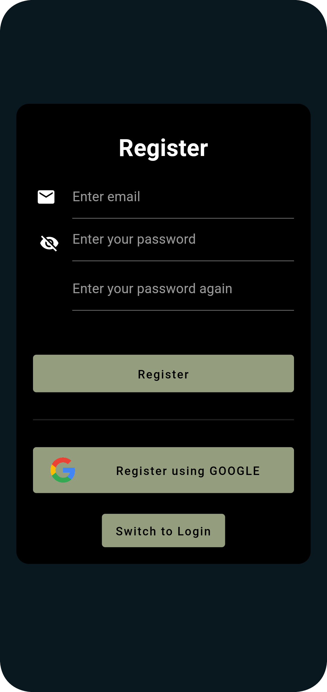
*Register for an account in dark mode.*

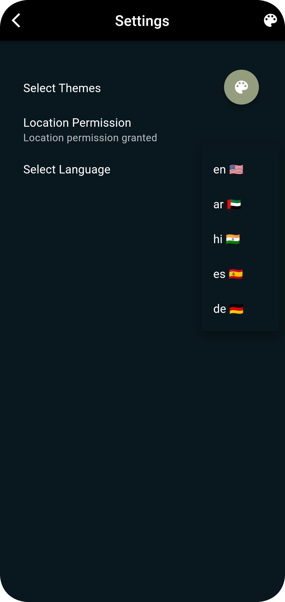
*Access app settings in dark mode.*

## Get Started

Ready to get started with Wifind? Head over to the Playstore to download the app for your device and start discovering free Wi-Fi hotspots today!

If you have any questions, feedback, or suggestions, please don't hesitate to [contact me](mailto:joris.haenseler@hispeed.ch). We're here to make your Wi-Fi hunting experience as smooth as possible.

Stay connected with Wifind, and never miss out on free Wi-Fi again!
